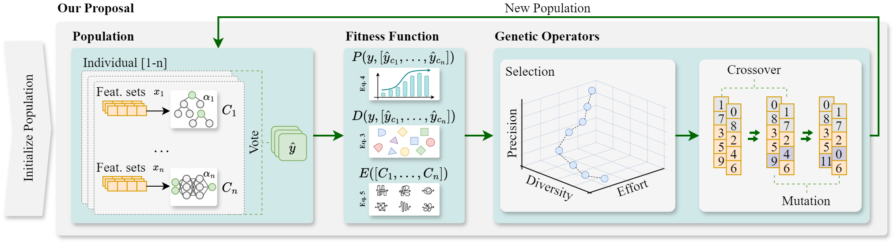
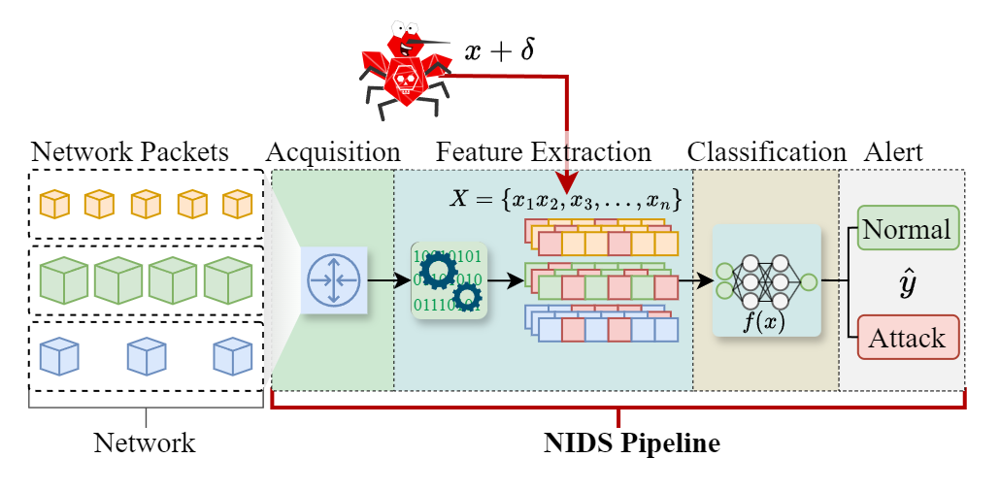
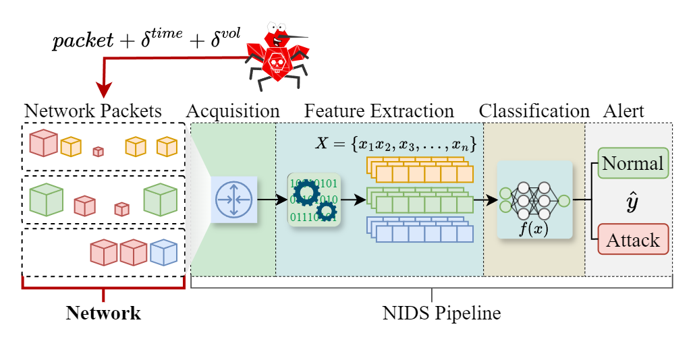
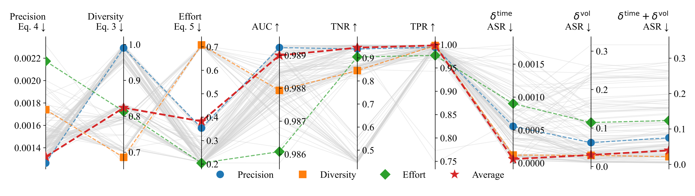

# Diversity-based Countermeasure for Adversarial Machine Learning Attacks Against ML-based NIDS

[](#)

This repository contains the code and resources associated with our paper, *"Diversity-based Countermeasure for Adversarial Machine Learning Attacks Against ML-based NIDS"*.

## Table of Contents
- [Overview](#overview)
- [Installation](#installation)
- [Project Structure](#project-structure)
- [Usage](#usage)
- [Results](#results)
- [Citation](#citation)

## Overview
Machine Learning (ML) techniques for Network Intrusion Detection Systems (NIDS) are vulnerable to adversarial attacks. To mitigate these vulnerabilities, we propose **Diversity-based Multi-Objective Optimization Defense (D-MOOD)**, an ensemble-based countermeasure that increases robustness through classification diversity.

The following figure illustrates the D-MOOD (Diversity-Based Multi-Objective Optimization Defense) proposed in the paper:



This repository provides:
- Source code to replicate the proposed method.
- Scripts for data preparation, model training, adversarial attack generation, and evaluation.
- Pre-trained models used for experimental evaluation.

## Installation

To set up the environment, you will need Python 3.11. Install the required dependencies using the following command:

```sh
pip install -r requirements.txt
```

The `requirements.txt` file includes all necessary packages for running the project, including machine learning libraries, optimization algorithms, and data handling utilities.

## Project Structure
The main components of the repository are organized as follows:

```
.
├── requirements.txt                  # File listing Python dependencies required for run the experiments and analyses in the paper.
└── source                             # Main directory containing all source files and scripts.
    ├── 3d_plot_animation_annotate.gif # 3D plot showing the Pareto front from the method using multi-objective optimization (MOO).
    ├── EspPipeML                      # Espindola machine learning pipeline library used for the work.
    ├── models                         # Directory containing trained models.
    ├── NSGA2Approaches.py             # Implementation of NSGA-II approaches for optimization (baselines).
    ├── NSGA2Proposal.py               # Implementation of our proposed approach, D-MOOD, using NSGA-II for optimization. 
    ├── Jupyter Notebooks              # Various notebooks for preparing datasets and evaluating results.
    ├── shell                          # Shell scripts for automation tasks.
    └── Various Python scripts         # Scripts for attack generation, dataset preparation, and ensemble operations.
```

### Key Files and Directories

- `EspPipeML/`  
  Contains scripts for processing and manipulating.
  - `adjust_pcap_timestamps.py`: Adjusts timestamps in a PCAP file, for performing a time AML attack.
  - `payload_manipulation.py`: Script for manipulating packet payloads, for performing a volume AML attack.
  - `time_volume_manipulations.py`: Script to adjust timestamps and manipulate packet payloads for combined time and volume AML attack.
  - `esp_utilities.py`: Contains utility functions and classes for data handling and processing.

- `models/`  
  Contains trained models used for evaluating our proposal and generating baselines.

- `NSGA2Approaches.py`  
  Implementation of different Non-dominated Sorting Genetic Algorithm II (NSGA-II) approaches.

- `Jupyter Notebooks/`  
  Includes:
  - `PerformsUnrealisticAttacks.ipynb`: Performing unexploitable adversarial attacks.
  - `PrepareDataset.ipynb`: Notebook for preparing datasets from raw flows.
  - `ProblemStatementEvaluation.ipynb`: Evaluates the problem statement and shows results of the baseline models.
  - `ProposalEvaluation.ipynb`: Evaluates the proposed model and compares it to the baseline models.

- `shell/`  
  Contains shell scripts for automation tasks such as:
  - `batch_go-flows.sh`: Runs the flow exporter in batch mode to extract network flow.
  - `batch_pcap_adjuster.sh`: Adjusts timestamps in PCAP files in batch mode.
  - `compress_and_delete.sh`: Compresses files and deletes the original ones to save space.
  - `features.json`: JSON file containing feature flow exporter definitions.

- `img/`  
  Contains images from the paper used in the `README.md` file.

## Usage

### Dataset Preparation and Feature Extraction
We use the raw [UNSW-NB15 dataset (PCAP format)](https://doi.org/10.1109/MilCIS.2015.7348942) and export our own features based on [IPFIX (Internet Protocol Flow Information Export)](https://www.iana.org/assignments/ipfix/ipfix.xhtml#:~:text=This%20Information%20Element%20is%20used%20to%20encapsulate%20non-%20IPFIX%20data). We extract the flow using [Go-Flows Exporter](https://doi.org/10.1109/COMST.2020.2989695) to obtain the features. To prepare the dataset for training, use the `PrepareDataset.ipynb` notebook located in the root directory. This notebook includes all necessary steps to convert flow traffic data into a suitable format for training machine learning models.


The dataset used in the paper is available at: [UNSW-NB15-ESP](https://github.com/espindolaallan/unsw-nb15-esp) 


### Models
There are pre-trained models available in this repository that were used in the experiments. You can also train your own models using different algorithms or adjusting the parameters in the provided Jupyter notebooks.


### Running Experiments
- **Unexploitable Adversarial Attacks**: Use `PerformsUnrealisticAttacks.ipynb` to replicate results from our paper involving unexploitable adversarial attacks.
    
- **Exploitable Adversarial Attacks**: To perform exploitable adversarial attacks, run the following scripts:
  - `adjust_pcap_timestamps.py` to perform time adversarial attacks.
  - `payload_manipulation.py` to perform volume adversarial attacks.
  - `time_volume_manipulations.py` to perform combined time & volume adversarial attacks.
    
  After performing these attacks, it is necessary to export the flows again to update the features.

- **Optimization Approaches**: The `NSGA2Approaches.py` script provides implementations of the Non-dominated Sorting Genetic Algorithm II (NSGA-II) to demonstrate the effectiveness of our D-MOOD strategy.


## Results
The results of our experiments, including robustness evaluations against adversarial attacks, are visualized in `ProposalEvaluation.ipynb`. Additionally, the animated 3D plot (`3d_plot_animation_annotate.gif`) provides a visual summary of the Pareto fronts generated by the optimization algorithm, highlighting the trade-offs between different objectives.

The following figure presents a parallel coordinates plot summarizing the Pareto front solutions of D-MOOD across different objectives and metrics, including precision, diversity, effort, AUC, TNR, TPR, and attack success rates (ASR):



## Citation

If you use this code in your research, please cite our paper (currently under review at **JNCA**):

> Espindola, A., Viegas, E., Casimiro, A., Santin, A., Ferreira, P.  
> *Diversity-based Countermeasure for Adversarial Machine Learning Attacks Against ML-based NIDS.*  
> Submitted to **Journal of Network and Computer Applications (JNCA)**, 2025.
